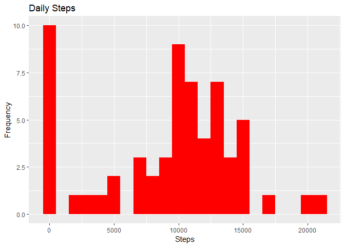
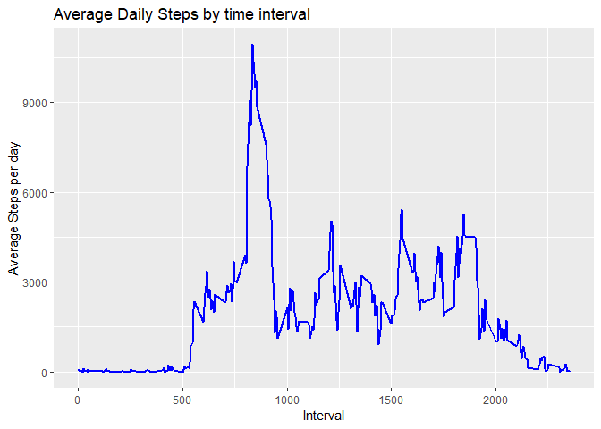
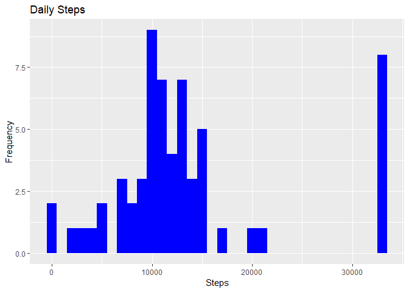
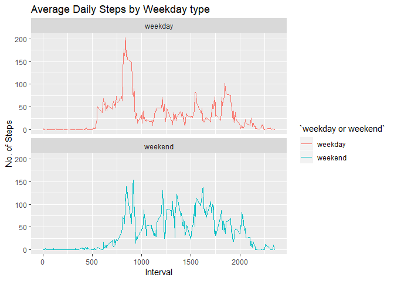

## Loading and preprocessing the data

```r
library(ggplot2)
```

```
## Registered S3 methods overwritten by 'ggplot2':
##   method         from 
##   [.quosures     rlang
##   c.quosures     rlang
##   print.quosures rlang
```

```r
# Download and unpack data file archive
datafileUrl <- "https://d396qusza40orc.cloudfront.net/repdata%2Fdata%2Factivity.zip"
datafile <- "./data/activity.csv"

# Download dataset if the file doesn't exist
if (!is_file(basename(datafileUrl))) {download.file(datafileUrl, destfile = basename(datafileUrl), method = "curl")}
if (!is_file(datafile)) {unzip(basename(datafileUrl), exdir = "data")}

## Reading csv Data into Data.Table. 
activityData <- read.csv(file = datafile)
```


## What is mean total number of steps taken per day?

```r
dailyStepTotal <- setNames(aggregate(activityData$steps, by=list(Category=activityData$date), FUN=sum, na.rm = T), c("Date","TotalSteps"))

ggplot(dailyStepTotal, aes(x = dailyStepTotal$TotalSteps)) +
    geom_histogram(fill = "red", binwidth = 1000) +
    labs(title = "Daily Steps", x = "Steps", y = "Frequency")
```

<!-- -->

```r
dev.print(png, "./figures/fig1.png", width=6, height=5)
```

```
## png 
##   2
```

```r
summary(dailyStepTotal$TotalSteps)
```

```
##    Min. 1st Qu.  Median    Mean 3rd Qu.    Max. 
##       0    6778   10395    9354   12811   21194
```
## What is the average daily activity pattern?

```r
intervalStepTotal <- setNames(aggregate(activityData$steps, by=list(date=activityData$interval), FUN=sum, na.rm = T), c("Interval", "TotalSteps"))

ggplot(intervalStepTotal, aes(x = intervalStepTotal$Interval , y = intervalStepTotal$TotalSteps)) + geom_line(color="blue", size=1) + labs(title = "Average Daily Steps by time interval", x = "Interval", y = "Average Steps per day")
```

<!-- -->

```r
dev.print(png, "./figures/fig2.png", width=6, height=5)
```

```
## png 
##   2
```

```r
# Interval with max steps on average
intervalStepTotal[intervalStepTotal$TotalSteps == max(intervalStepTotal$TotalSteps),]
```

```
##     Interval TotalSteps
## 104      835      10927
```

## Imputing missing values

```r
# Number of rows with NA value in steps data
nrow(activityData[is.na(activityData$steps),])
```

```
## [1] 2304
```

```r
intMeans <- setNames(aggregate(activityData$steps, by=list(Category=activityData$interval), FUN=mean, na.rm=T), c("interval", "MeanSteps"))

activityData_merge <- merge(activityData, intMeans, by="interval", all=T)

activityData_mergedandsorted <- activityData_merge[order(activityData_merge$date),]

activityData_mergedandsorted$steps <- ifelse(is.na(activityData_mergedandsorted$steps), as.double(as.factor(activityData_mergedandsorted$MeanSteps)), activityData_mergedandsorted$steps)

dailyStepTotal_mod <- setNames(aggregate(activityData_mergedandsorted$steps, by=list(Category=activityData_mergedandsorted$date), FUN=sum, na.rm = T), c("Date","TotalSteps"))

ggplot(dailyStepTotal_mod, aes(x = dailyStepTotal_mod$TotalSteps)) +
    geom_histogram(fill = "blue", binwidth = 1000) +
    labs(title = "Daily Steps", x = "Steps", y = "Frequency")
```

<!-- -->

```r
dev.print(png, "./figures/fig3.png", width=8, height=5)
```

```
## png 
##   2
```

```r
summary(dailyStepTotal_mod$TotalSteps)
```

```
##    Min. 1st Qu.  Median    Mean 3rd Qu.    Max. 
##      41    9819   11458   13656   15084   32800
```

## Are there differences in activity patterns between weekdays and weekends?


```r
activityDataTable <- data.table::fread(input = "data/activity.csv")
activityDataTable[, date := as.POSIXct(date, format = "%Y-%m-%d")]
activityDataTable[, `Day of Week`:= weekdays(x = date)]
activityDataTable[grepl(pattern = "Monday|Tuesday|Wednesday|Thursday|Friday", x = `Day of Week`), "weekday or weekend"] <- "weekday"
activityDataTable[grepl(pattern = "Saturday|Sunday", x = `Day of Week`), "weekday or weekend"] <- "weekend"
activityDataTable[, `weekday or weekend` := as.factor(`weekday or weekend`)]

activityDataTable[is.na(steps), "steps"] <- activityDataTable[, c(lapply(.SD, median, na.rm = TRUE)), .SDcols = c("steps")]
intDataTable <- activityDataTable[, c(lapply(.SD, mean, na.rm = TRUE)), .SDcols = c("steps"), by = .(interval, `weekday or weekend`)] 

# panel plot
ggplot(intDataTable , aes(x = interval , y = steps, color=`weekday or weekend`)) + geom_line() + labs(title = "Average Daily Steps by Weekday type", x = "Interval", y = "No. of Steps") + facet_wrap(~`weekday or weekend` , ncol = 1, nrow=2)
```

<!-- -->

```r
dev.print(png, "./figures/fig4.png", width=8, height=5)
```

```
## png 
##   2
```
